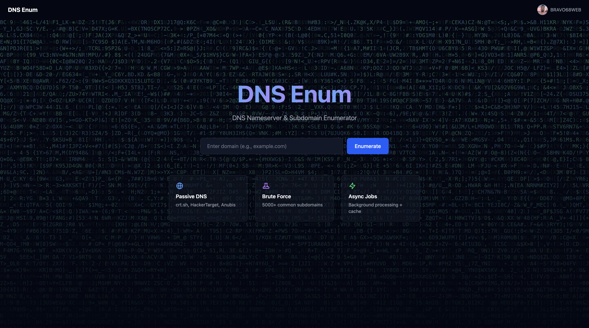
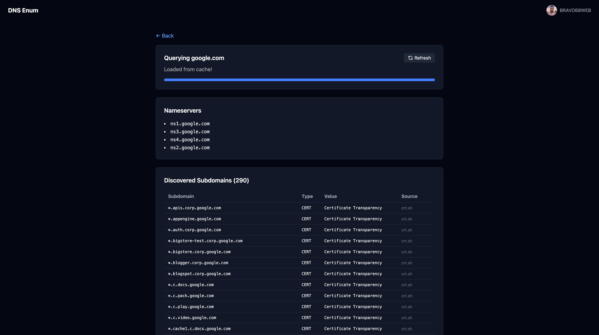

<div align="center">

# 🔍 DNS Enum

### DNS Nameserver & Subdomain Enumerator

[](https://honox.dev/)
[](https://tailwindcss.com/)
[](https://www.typescriptlang.org/)
[](https://workers.cloudflare.com/)
[](LICENSE)
[](https://github.com/BRAVO68WEB/dns-enum)

[Features](#-features) • [Quickstart](#-quickstart) • [API](#-api) • [Architecture](#-architecture) • [Deployment](#-deployment)

---

### 🖥️ Screenshots

<div align="center">



*Landing page*



*Subdomain enumeration results with async polling*

</div>

---

</div>

---

## ✨ Features

<table>
<tr>
<td width="50%">

### 🔎 Passive DNS
- 📜 **crt.sh** — Certificate Transparency logs
- 🎯 **HackerTarget** — Passive DNS database
- 🛡️ **Anubis** — Subdomain enumeration

</td>
<td width="50%">

### 💥 Brute Force
- ⚡ **5000+ common subdomains** via DNS resolution
- 📦 **4.7M full wordlist** from [SecLists](https://github.com/danielmiessler/SecLists)
- 🚀 **100 concurrent** DNS queries

</td>
</tr>
<tr>
<td>

### 🔐 Authentication
- 🐙 **GitHub OAuth** with JWT sessions
- 🍪 **Secure cookies** (httpOnly, sameSite)
- 👤 **Avatar display** for logged-in users

</td>
<td>

### ⚡ Performance
- ☁️ **KV caching** for instant results
- 🔄 **Async job queue** with background processing
- 📊 **Rate limiting** (2 free cached, auth for new searches)

</td>
</tr>
</table>

---

## 🚀 Quickstart

### 📦 Install & Run

```bash
# Clone the repo
git clone https://github.com/BRAVO68WEB/dns-enum.git
cd dns-enum

# Install dependencies
pnpm install

# Setup environment
cp .env.example .env

# Start dev server
pnpm dev
```

🌐 Open **http://localhost:5173**

### ⚙️ Environment Variables

| Variable | Description | Required |
|----------|-------------|----------|
| `GITHUB_CLIENT_ID` | GitHub OAuth App Client ID | ✅ |
| `GITHUB_CLIENT_SECRET` | GitHub OAuth App Client Secret | ✅ |
| `JWT_SECRET` | JWT signing key (min 32 chars) | ✅ |

### 🔑 GitHub OAuth Setup

1. 🌐 Go to [GitHub Developer Settings](https://github.com/settings/developers)
2. ➕ Click **New OAuth App**
3. 📝 Set **Authorization callback URL** to:
   ```
   http://localhost:5173/auth/github/callback
   ```
4. 📋 Copy **Client ID** and **Client Secret** to `.env`

---

## 📡 API

### 🔍 Query Domain

```bash
# First visit to get session cookie
curl -c cookies.txt http://localhost:5173/

# Create async job (requires visitor_id cookie)
curl -X POST http://localhost:5173/api/jobs \
  -H "Content-Type: application/json" \
  -b cookies.txt \
  -d '{"domain": "example.com"}'

# Response: {"error": "auth_required", "message": "Sign in to search new domains"}
```

### 📊 Poll Job Status

```bash
# Check job status
curl http://localhost:5173/api/jobs/abc123

# Response when complete:
# {
#   "id": "abc123",
#   "status": "complete",
#   "result": {
#     "nameservers": ["ns1.example.com", "ns2.example.com"],
#     "subdomains": [
#       {"name": "www.example.com", "type": "A", "value": "93.184.216.34", "source": "crt.sh"},
#       {"name": "api.example.com", "type": "A", "value": "93.184.216.35", "source": "wordlist"}
#     ]
#   }
# }
```

### 🔐 Force Refresh (Authenticated)

```bash
# Bypass cache
curl -X POST http://localhost:5173/api/jobs \
  -H "Content-Type: application/json" \
  -H "Cookie: session=<jwt_token>" \
  -d '{"domain": "example.com", "force": true}'
```

### 🔒 Auth Flow

| Scenario | Requirement |
|----------|-------------|
| Visit landing page | Sets `visitor_id` cookie |
| First 2 cached searches | Free (no auth) |
| 3rd+ cached search | Requires GitHub OAuth |
| New domain search | Requires GitHub OAuth |
| Force refresh | Requires GitHub OAuth |

### 📋 All Endpoints

| Method | Path | Description | Auth |
|--------|------|-------------|------|
| `GET` | `/` | 🏠 Landing page | ❌ Sets visitor_id |
| `GET` | `/results?domain=` | 📊 Results with polling | ❌ |
| `POST` | `/api/jobs` | ➕ Create DNS job | ⚠️ visitor_id required |
| `GET` | `/api/jobs/:id` | 📈 Poll job status | ⚠️ visitor_id required |
| `GET` | `/auth/github` | 🔑 OAuth redirect | ❌ |
| `GET` | `/auth/github/callback` | 🔄 OAuth callback | ❌ |
| `GET` | `/auth/logout` | 🚪 Clear session | ❌ |

---

## 🏗️ Architecture

```
📦 dns-enum/
├── 📂 app/
│   ├── 📂 routes/
│   │   ├── 🏠 index.tsx              # Landing page with LetterGlitch bg
│   │   ├── 📊 results.tsx            # Async polling results page
│   │   ├── 📂 auth/
│   │   │   ├── 🐙 github.ts          # OAuth redirect
│   │   │   └── 🔄 github/callback.ts # Token exchange
│   │   └── 📂 api/jobs/
│   │       ├── ➕ index.ts            # Create job endpoint
│   │       └── 📈 [id].ts            # Poll status endpoint
│   ├── 📂 lib/
│   │   ├── 🔍 dns.ts                 # DNS query engine
│   │   ├── 💾 cache.ts               # KV caching layer
│   │   ├── 📖 wordlist-loader.ts     # Full wordlist (4.7M)
│   │   └── 📋 wordlist.ts            # Top 5000 hardcoded
│   └── 🎨 style.css                  # Tailwind entry
├── 📂 data/
│   ├── 📄 subdomains-5000.txt        # Top 5000 subdomains
│   └── 📦 subdomains-top1million-full.7z  # Full wordlist
├── ⚙️ wrangler.jsonc                 # CF Workers config
├── 🐳 Dockerfile                     # Container config
└── 📖 README.md                      # This file
```

### 🔄 Data Flow

```
┌─────────────┐     ┌──────────────┐     ┌─────────────┐
│   Browser   │────▶│  HonoX API   │────▶│  DNS Engine │
└─────────────┘     └──────────────┘     └─────────────┘
                           │                     │
                           ▼                     ▼
                    ┌──────────────┐     ┌──────────────────┐
                    │   KV Cache   │     │  Passive DNS     │
                    └──────────────┘     │  - crt.sh        │
                                         │  - HackerTarget  │
                                         │  - Anubis        │
                                         └──────────────────┘
```

---

## 🛠️ Tech Stack

| Technology | Purpose | Link |
|------------|---------|------|
| 🟠 **HonoX** | Full-stack framework | [GitHub](https://github.com/honojs/honox) |
| 🟡 **Hono** | Web framework | [hono.dev](https://hono.dev/) |
| 🎨 **Tailwind CSS** | Styling | [tailwindcss.com](https://tailwindcss.com/) |
| 🔵 **TypeScript** | Type safety | [typescriptlang.org](https://www.typescriptlang.org/) |
| ☁️ **Cloudflare Workers** | Deployment | [workers.cloudflare.com](https://workers.cloudflare.com/) |
| 📦 **@layered/dns-records** | DNS querying | [GitHub](https://github.com/LayeredStudio/dns-records) |
| 📖 **SecLists** | Subdomain wordlist | [GitHub](https://github.com/danielmiessler/SecLists) |

---

## 🚀 Deployment

### ☁️ Cloudflare Workers

```bash
# Build for production
pnpm build

# Deploy to Cloudflare
wrangler deploy
```

### 🐳 Docker

```bash
# Build and run
docker compose up --build

# Or pull from registry
docker pull ghcr.io/BRAVO68WEB/dns-enum:latest
docker run -p 3000:3000 ghcr.io/BRAVO68WEB/dns-enum:latest
```

### 📝 Manual Deploy

```bash
# Build
pnpm build

# Run in production
NODE_ENV=production node dist/server.js
```

---

## 🤝 Contributing

1. 🍴 Fork the repository
2. 🌿 Create a feature branch (`git checkout -b feature/amazing-feature`)
3. 💾 Commit changes (`git commit -m 'Add amazing feature'`)
4. 📤 Push to branch (`git push origin feature/amazing-feature`)
5. 🔄 Open a Pull Request

---

## 📄 License

MIT License - see [LICENSE](LICENSE) for details

---

<div align="center">

**Made with ❤️ and ☕**

[](https://github.com/BRAVO68WEB/dns-enum)
[](https://github.com/BRAVO68WEB/dns-enum)

</div>
